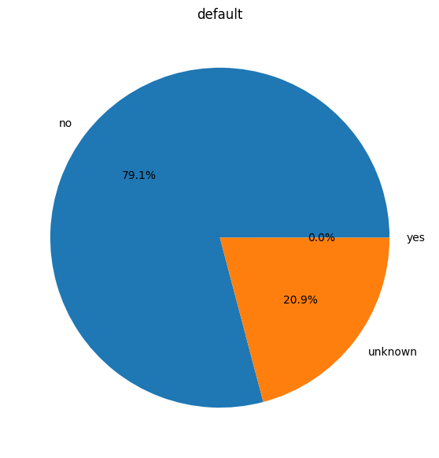
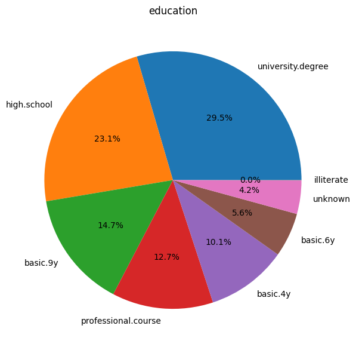
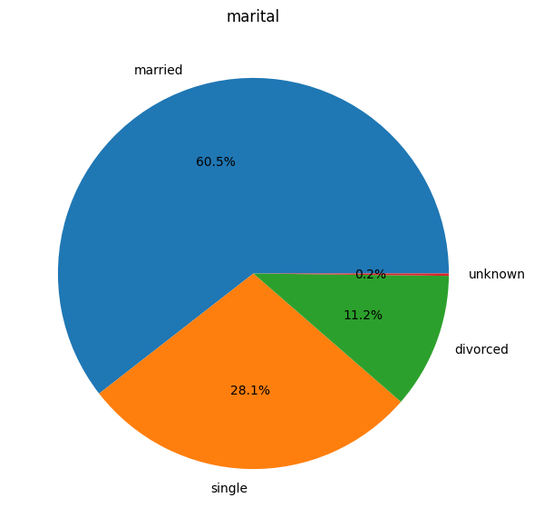
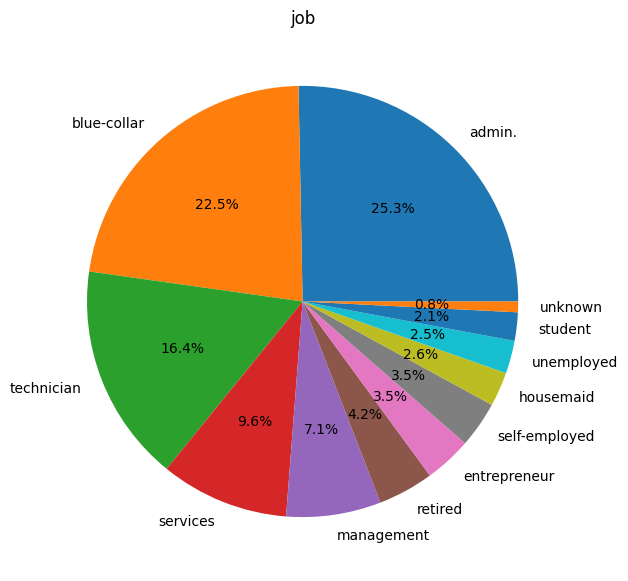
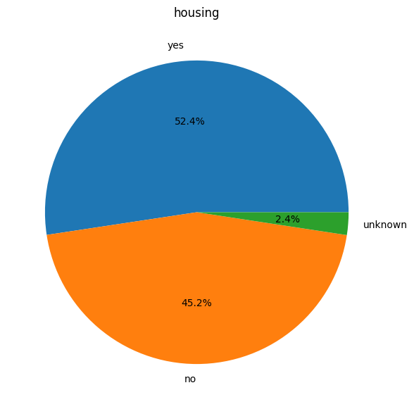
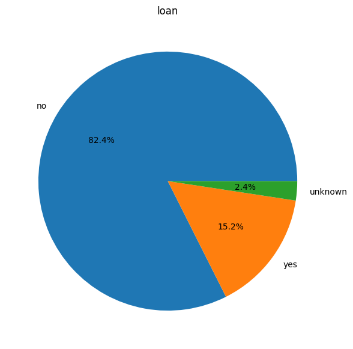
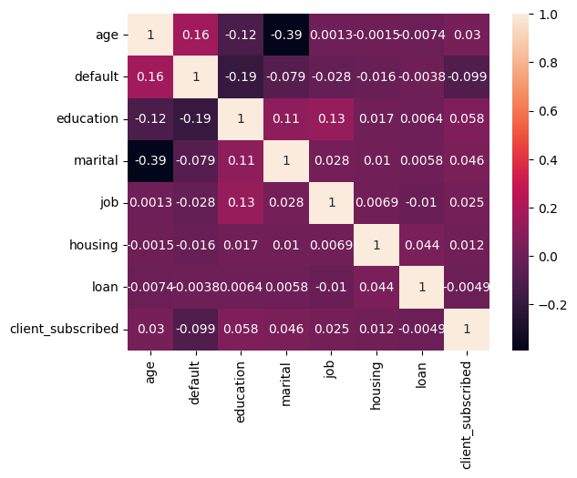
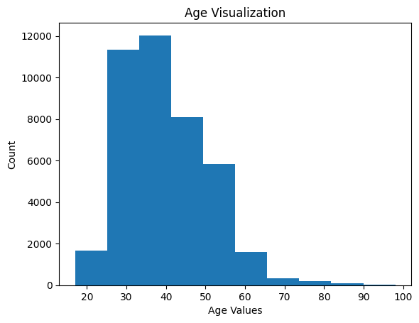
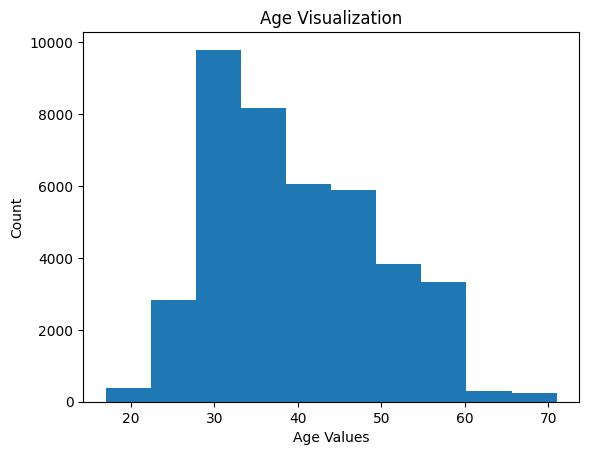

# Practical-Application-Assignment_17_1

## Direct marketing campaigns of a Portuguese banking institution

## Context
### According to the source of the dataset provided:
#### The data is related with direct marketing campaigns (phone calls) of a Portuguese banking institution. The classification goal is to predict if the client will subscribe a term deposit (variable y).

## Business Understanding
### Objective
#### The object is to find a model that will provide a profile of people who will subscribe to the bank term deposit.

#### Many of the features in the dataset provided for this project are described in the "Data Understanding".  We can leverage and tweak them to find the best model.  The initial focus will be to build a codebase that can be leveraged with modifications afterwards.

## Data Understanding

### Data Descriptions
#### Here is the preliminary info about our dataset.
    RangeIndex: 426880 entries, 0 to 426879\n
    Data columns (total 18 columns):
        Column        Non-Null Count   Dtype  
    ---  ------        --------------   -----   
     0   age             41188 non-null  int64  
     1   job             41188 non-null  object 
     2   marital         41188 non-null  object 
     3   education       41188 non-null  object 
     4   default         41188 non-null  object 
     5   housing         41188 non-null  object 
     6   loan            41188 non-null  object 
     7   contact         41188 non-null  object 
     8   month           41188 non-null  object 
     9   day_of_week     41188 non-null  object 
     10  duration        41188 non-null  int64  
     11  campaign        41188 non-null  int64  
     12  pdays           41188 non-null  int64  
     13  previous        41188 non-null  int64  
     14  poutcome        41188 non-null  object 
     15  emp.var.rate    41188 non-null  float64
     16  cons.price.idx  41188 non-null  float64
     17  cons.conf.idx   41188 non-null  float64
     18  euribor3m       41188 non-null  float64
     19  nr.employed     41188 non-null  float64
     20  y               41188 non-null  object 
    dtypes: float64(5), int64(5), object(11)
    memory usage: 6.6+ MB

#### Here is the a list of descriptions for the features in the dataset.

##### bank client data:
   1 - age (numeric) 
   2 - job : type of job (categorical: "admin.","unknown","unemployed","management","housemaid","entrepreneur","student","blue-collar","self-employed","retired","technician","services")  
   3 - marital : marital status (categorical: "married","divorced","single"; note: "divorced" means divorced or widowed) 
   4 - education (categorical: "unknown","secondary","primary","tertiary") 
   5 - default: has credit in default? (binary: "yes","no") 
   6 - balance: average yearly balance, in euros (numeric)  
   7 - housing: has housing loan? (binary: "yes","no") 
   8 - loan: has personal loan? (binary: "yes","no") 

##### related with the last contact of the current campaign:
   9 - contact: contact communication type (categorical: "unknown","telephone","cellular")  
  10 - day: last contact day of the month (numeric) 
  11 - month: last contact month of year (categorical: "jan", "feb", "mar", ..., "nov", "dec") 
  12 - duration: last contact duration, in seconds (numeric) 

##### other attributes:
  13 - campaign: number of contacts performed during this campaign and for this client (numeric, includes last contact) 
  14 - pdays: number of days that passed by after the client was last contacted from a previous campaign (numeric, -1 means client was not previously contacted) 
  15 - previous: number of contacts performed before this campaign and for this client (numeric) 
  16 - poutcome: outcome of the previous marketing campaign (categorical: "unknown","other","failure","success") 

##### Output variable (desired target):
  17 - y - has the client subscribed a term deposit? (binary: "yes","no") 

#### Here are some Pie Charts that show proportions in the some of the features.
#### These will be useful later during my analysis.

#### Here are the magnitude of individual features correlated to the 'y' feature and the Heatmaps visualization
<ul>
<li>default    -0.099364</li>
<li>education	0.057776</li>
<li>marital	    0.046249</li>
<li>age	        0.030381</li>
<li>job	        0.025248</li>
<li>housing	    0.011613</li>
<li>loan	   -0.004922</li>
</ul>
 

### Model Comparisons
##### This table represents the Features that were selected by different models & feature selectors
<table>
<tr><th>Model</th><th>Feature Selector</th><th>Selected Features</th></tr>
<tr><td>Logistic Regression</td><td>Recursive Feature Elimination</td><td>['default', 'education', 'housing', 'loan', 'marital']</td></tr>
<tr><td>Logistic Regression</td><td>SequentialFeatureSelector</td><td>['age', 'default', 'education', 'housing', 'loan']</td></tr>
<tr><td>KNeighbors Classifier</td><td>Recursive Feature Elimination</td><td>SequentialFeatureSelector</td><td>['default', 'education', 'housing', 'loan', 'marital']</td></tr>
<tr><td>Decision Tree Classifier</td><td>Recursive Feature Elimination</td><td><b>['age', 'education', 'housing', 'job', 'marital']</b></td></tr>
<tr><td>Decision Tree Classifier</td><td>SequentialFeatureSelector</td><td>['default', 'education', 'housing', 'loan', 'marital']</td></tr>
<tr><td>Support Vector Classification</td><td>Recursive Feature Elimination</td><td>['age', 'default', 'housing', 'loan', 'marital']</td></tr>
</table>

##### This table represents the Features that were selected, how many it was selected, and relevant pie chart data.
##### The <b>bold</b> features were selected for modeling and predictions.
<table>
<tr><th>Feature</th><th>Count</th><th>Pie Chart</th></tr>
<tr><td><b>job</b></td><td>1</td><td></td></tr>
<tr><td><b>age</td><td>3</td><td></td></tr>
<tr><td>default</td><td>5</td><td>no 79.1% , unknown 20.9% , yes 0%</td></tr>
<tr><td><b>education</td><td>5</td><td></td></tr>
<tr><td>loan</td><td>5</td><td> no 82.4% , yes 15.2% , unknown 2.4%</td></tr>
<tr><td><b>marital</td><td>6</td><td></td></tr>
<tr><td><b>housing</td><td>6</td><td>yes 52.4% , no 45.2% , unknown 2.4%</td></tr>
</table>

#### Here's a table comparing the Baseline Models without any Hyper Parameters

##### Improving the Model
##### The age feature appears to be skewered to the left and could use some attention.
##### Using Zscore greater than 3 we can eliminate 369 outliers and forgo normalizing this feature.

<table>
<tr><th>Before</th><th>After</th></tr>
<tr><td> </td><td></td></tr>
</table>

#### Here's a table comparing the Baseline Models with the Same Models using Hyper Parameters
